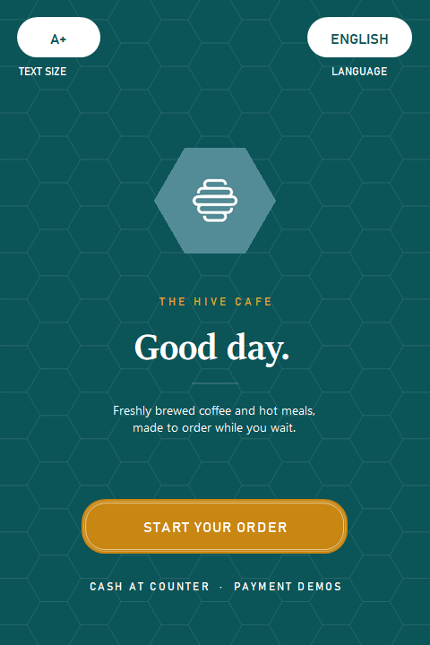
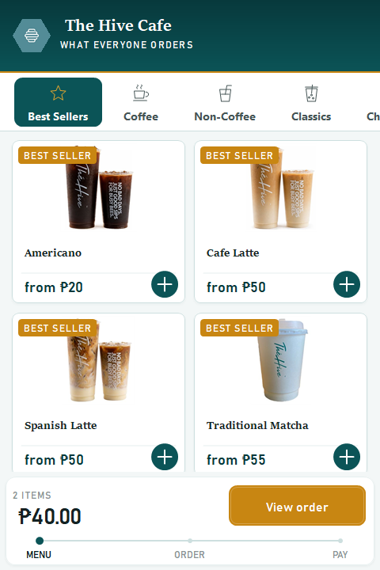
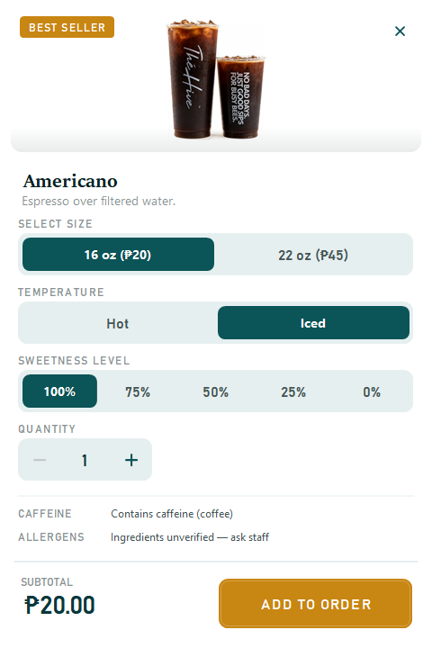
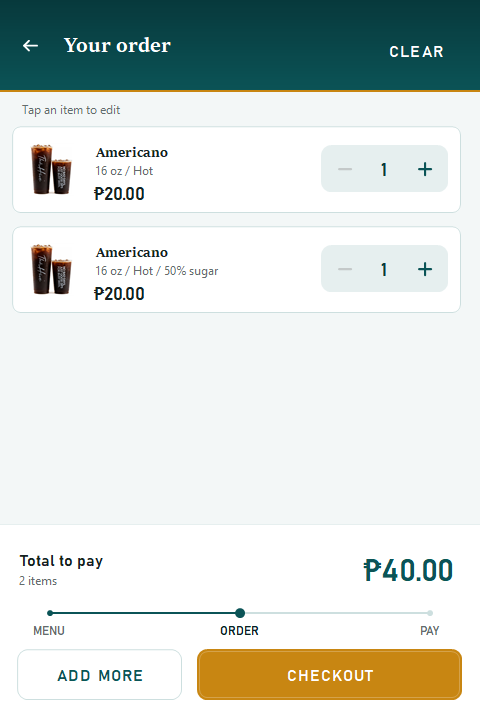
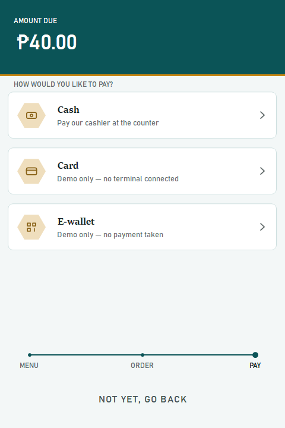
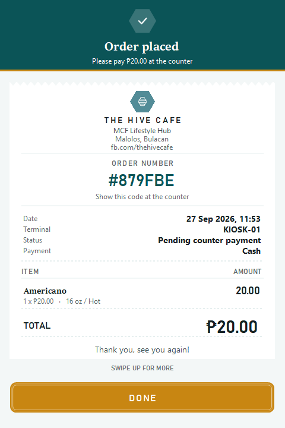

# The Hive Cafe — Self-Order Kiosk

A touchscreen self-ordering kiosk for a real cafe, built with C# and WinForms.
No web stack, no game engine — every screen, button, and animation is drawn
by hand on top of raw GDI+.

This is my first solo project, from a starter WinForms template into a
full point-of-sale flow: browse the menu, build an order, pay by cash,
card, or e-wallet, and get a receipt — all inside one window.

<p align="center">
  
  
  
</p>
<p align="center">
  
  
  
</p>

## Features

- **One window, no popups.** Every screen — menu, item detail, cart,
  payment, receipt — is a page hosted inside a single shell window, with
  back/forward navigation instead of a stack of loose dialogs.
- **Hand-painted UI kit.** Buttons, tabs, a segmented selector, a quantity
  stepper, and product tiles are custom `Control` subclasses drawn with
  GDI+ — no third-party UI library.
- **Data-driven menu.** 46 products across 7 categories, defined in one
  `MenuCatalog.cs` file. Adding a drink is one entry, not a new form.
- **Smooth by design.** Hover/press states run on a real 60fps timer loop
  (Windows timers round `16ms` up to `~32fps` — this one asks for `15ms`
  instead), and product photos are pre-scaled and cached so scrolling a
  photo-heavy category doesn't stutter.
- **Till-style receipt.** A laid-out slip with a per-day order number,
  itemised lines, and a plain-text copy saved for a receipt printer.
- **Three payment paths.** Cash, card (with live card-type detection and
  formatting), and e-wallet (QR code), each ending on the same receipt flow.

## Tech stack

C# · WinForms · .NET Framework · GDI+ — no external UI or database
dependency. Orders live in memory for the length of a transaction; nothing
is persisted beyond the printed receipt copy.

## Project structure

```
kiosk/
  UI/                 Design system: colours, type, shapes, hand-painted
                       controls, the navigation shell, the menu catalog
  Payments/            Cash, card, e-wallet, payment picker, receipt
  OrderForms/          Cart, line-item editor, order model
  Properties/           App resources (product photography, icons)
  Resources/            Product photos, referenced by MenuCatalog.cs
  Form1.cs              Welcome screen
  menuPage.cs            Menu / ordering screen
```

## Running it

1. Open `kiosk.sln` in Visual Studio (2022 or later).
2. Set `kiosk` as the startup project if it isn't already.
3. Press **F5**.

The app opens at 480×720 — kiosk-portrait size — and runs the full flow
from a cold start.

## Known limitations

- No database — this was built without access to the cafe's real backend,
  so orders are in-memory only and reset between runs.
- A handful of menu items don't have product photography yet and show a
  "Photo coming soon" placeholder instead.
- Receipts print `THIS IS NOT AN OFFICIAL RECEIPT`, since the kiosk isn't
  BIR-accredited to issue one.

## License

MIT — see [LICENSE](LICENSE). Use it, learn from it, build on it; just
keep the copyright notice.
