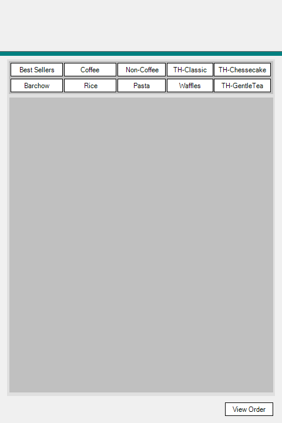
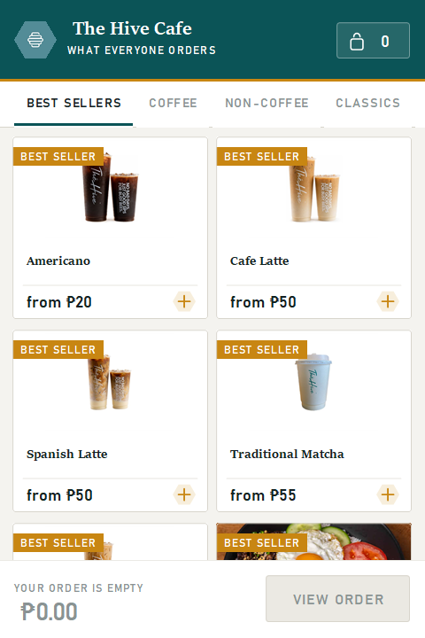

# Release history

| Version | Date | Highlights |
| --- | --- | --- |
| [v2.3](v2.3.md) | September 2026 | Sold-out items shown dimmed instead of hidden |
| [v2.2](v2.2.md) | September 2026 | Item-added confirmation above the cart, release history back to the start |
| [v2.1](v2.1.md) | September 2026 | Short guest order codes, receipt scroll cue, touchscreen clear confirmation, calmer safety notes, corners pulled back from pills |
| [v2.0](v2.0.md) | September 2026 | Category icons, Menu → Order → Pay progress line, English/Filipino, cart editing, saved orders, sold-out checks, staff screen |
| [v1.1](v1.1.md) | August 2026 | The front end rebuilt on its own design system, whole flow in one window |
| [v1.0](v1.0.md) | March 2026 | The first working version — designer-built WinForms, one window per screen |

  
  
  

<em>The same screen at v1.0, v1.1 and v2.2.</em>

