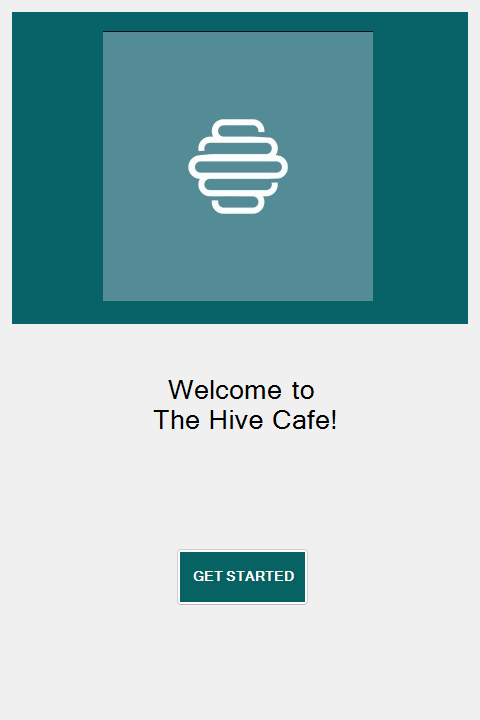
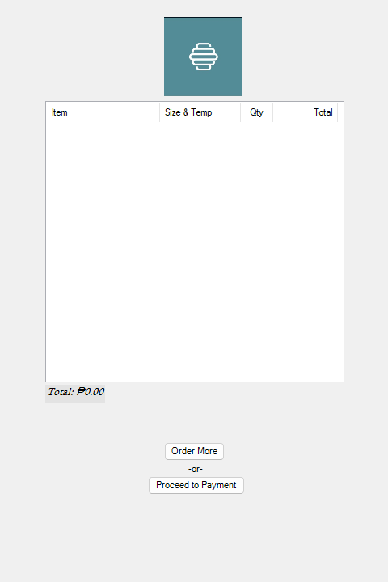

# The Hive Cafe Kiosk — v1.0

*25 March 2026 · commit `d2376f7` · the first working version*

Built with the Visual Studio designer and stock WinForms controls, one window
per screen. Everything the kiosk does today — browse, customize, review, pay,
print — it already did here, just plainly.

  
  
  

## What it did

- A welcome screen, a menu, an order summary, payment selection, and a receipt.
- Ten category buttons across two rows. Tapping one loaded that category's form
  into the panel below it.
- Size, temperature and quantity per item, with the running order kept in a
  shared `OrderStorage` and totalled in a `ListView`.
- Cash, card and e-wallet screens, and a printable receipt.

## How it looked

Stock button chrome, system fonts, a grey panel, and placeholder art standing in
for product photos that had not been taken yet. Functional first, decorated
later — which is the right order to build things in.

## What came next

[v1.1](v1.1.md) rebuilt the front end on its own design system and moved the
whole flow into a single window.
