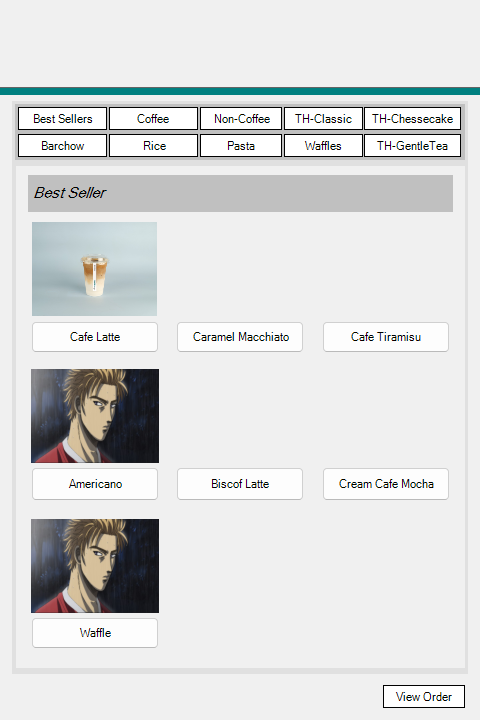

# The Hive Cafe Kiosk — v1.0

*25 March 2026 · commit `d2376f7` · where it started*

The first working version. Built with the Visual Studio designer and stock
WinForms controls, one window per screen. Everything the kiosk does today —
browse, customize, review, pay, print — it already did here, just plainly.

  
  
  

## What it did

- A welcome screen, a menu, an order summary, payment selection, and a receipt.
- Ten category buttons across two rows. Tapping one loaded that category's form
  into the panel below it.
- Size, temperature and quantity per item, with the running order kept in a
  shared `OrderStorage` and totalled in a `ListView`.
- Cash, card and e-wallet screens, and a printable receipt.

## How it looked

Stock button chrome, system fonts, a grey panel, and placeholder art standing in
for product photos that had not been taken yet. Functional first, decorated
later — which is the right order to build things in.

## What came next

v2.0 rebuilt the front end on a shared design system and moved every screen into
a single window, so moving between the menu, payment and the receipt swaps the
contents instead of opening another window. The ordering logic in this version
is the direct ancestor of what still runs today.

See [v2.0](v2.0.md) and [v2.1](v2.1.md).
