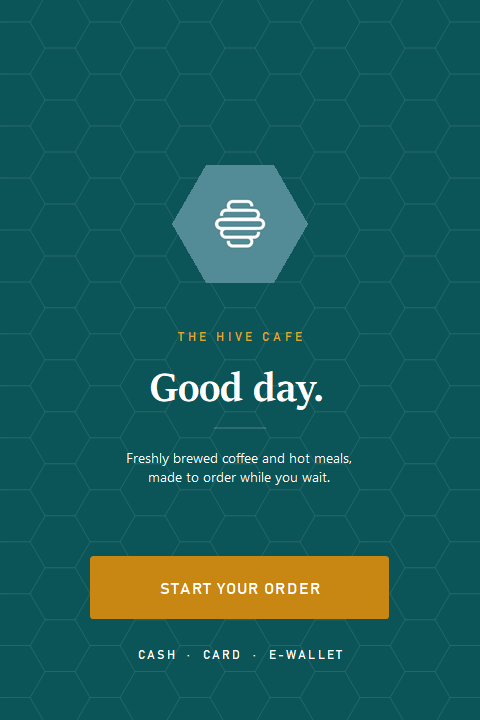
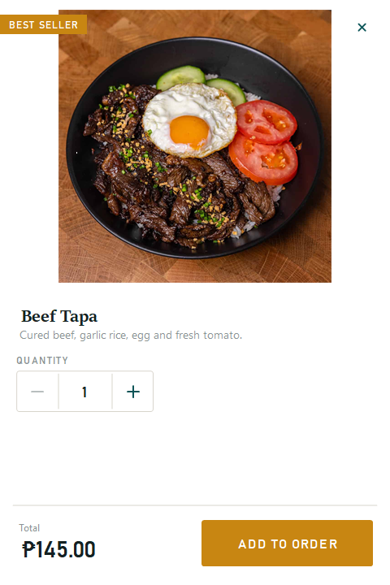
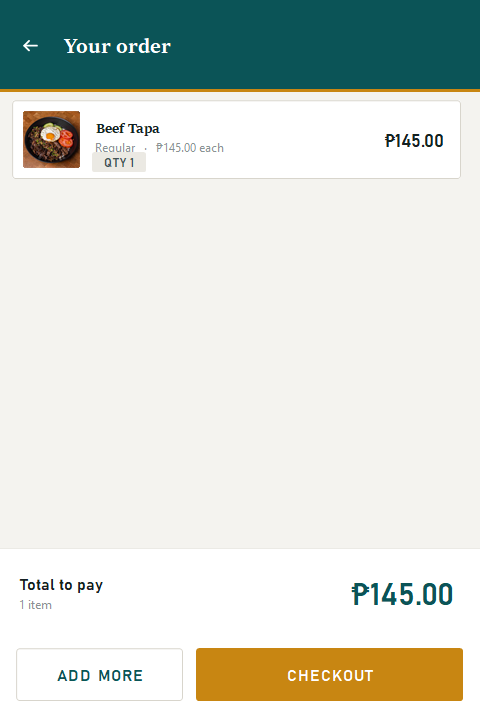
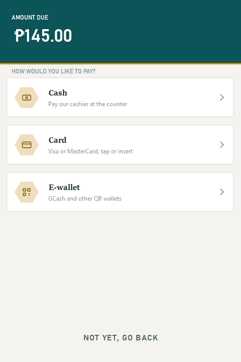
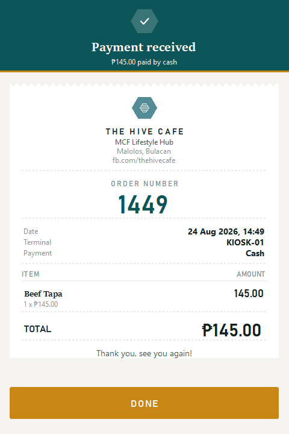

# The Hive Cafe Kiosk — v1.1

*August 2026 · where the kiosk as it looks today began*

The front end rebuilt on its own design system instead of the Visual Studio
designer. One window for the whole flow — welcome, menu, item, order, payment,
receipt — with every button, tab and animation painted by hand on GDI+ rather
than assembled from stock Windows controls.

  
  
  

  
  
  

## What changed

- **One window.** Moving between the menu, payment and the receipt swaps the
  contents instead of opening another window.
- **The menu became data.** One catalog file holds every product, with real
  in-store prices transcribed from the cafe's printed menu. Adding a drink is
  one entry, not three new files.
- **Product photography on the tiles**, replacing the placeholder art.
- **A till-style receipt** with a per-day order number, itemised lines, and a
  40-column printable copy.
- **Smooth by design.** Hover and press states run on a real 60fps timer, and
  menu photos are pre-scaled and cached so a photo-heavy category scrolls
  without tearing.

## How it looked

Sitka for the cafe name and the food, Bahnschrift for prices and labels. Corners
just off square, teal from the hive logo, honey kept for the one action that
mattered on each screen. That palette and type pairing is still what the kiosk
uses today.

## What came next

[v2.0](v2.0.md) added category icons, the Menu → Order → Pay progress line,
English and Filipino, cart editing, saved orders, sold-out checks and the staff
screen.
