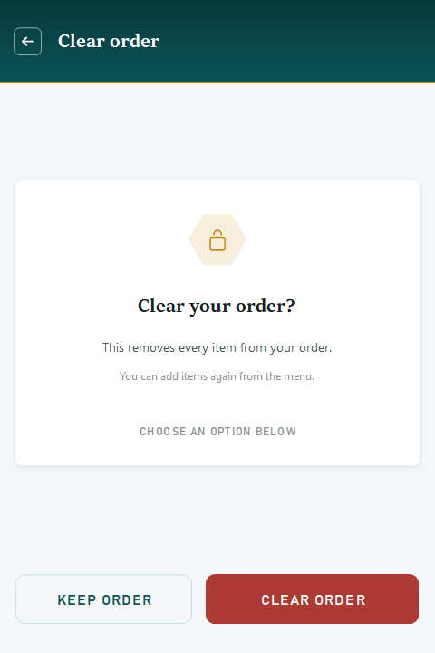

# The Hive Cafe Kiosk — v2.1.0

A guest-facing polish release. Nothing about how you order changed; a lot about how clearly the kiosk talks to you did.

## New

- **Short order codes.** Receipts now show a code a person can actually read out — `#637E93` instead of a long internal ID. Cash orders say **Show this code at the counter**; card and e-wallet say **Keep this code for reference**. Staff see the same short code, and the full ID is still kept in storage.
- **Scroll cue on long receipts.** A quiet **Swipe up for more** hint appears when a receipt runs past the screen, and disappears once you reach the end.
- **Touchscreen clear confirmation.** Clearing the cart used to open a Windows dialog with small system buttons. It is now a proper kiosk screen offering **Keep order** and **Clear order**, sized for fingers.

## Improved

- **Cart rows read as editable.** A **Tap an item to edit** hint sits above the order list, so guests stop treating the cart as a dead summary.
- **Calmer product safety notes.** Caffeine and allergen guidance moved out of a tinted box into aligned label-and-value rows under a hairline rule. Less shouting, easier to scan, and still explicit that allergen information is unverified.
- **Corners tuned back toward the house style.** Cards and buttons had drifted to fully-rounded pill shapes. They now sit at a disciplined 8px / 10px, with a 12px radius reserved for floating panels like the cart tray. Less delivery-app, more printed cafe card. The circular add button is unchanged.

## Removed

- **The A+ larger-text toggle.** It reflowed and clipped text unpredictably across screens, and the base type is already sized for arm's-length reading. Removed rather than left half-working.

## Payment status

Unchanged, and worth repeating: **there is no connected payment processor.** Cash orders wait for payment at the counter. Card and e-wallet are clearly labelled demonstrations — they do not charge money, collect card details, or show a live payment QR. Receipts are local text copies, not official tax receipts.

## Install

Build from source at tag `v2.1.0` and run `kiosk/bin/Release/kiosk.exe` on Windows with .NET Framework 4.7.2 or later installed. Keep `System.Data.SQLite.dll` and `kiosk.exe.config` beside the executable.

## Gallery

| Customize | Review | Clear confirmation |
| --- | --- | --- |
|  |  |  |

Verified with the repository smoke suite — 30 checks covering cart merging, availability, guest codes, the receipt scroll cue, clear keep/confirm behaviour, storage failure handling, and idle reset — plus a rendered-screen review of every customer screen in English and Filipino.

Product photos and rice-meal prices still need confirmation from the cafe. Verify each product's ingredients and allergen notes before live service.
