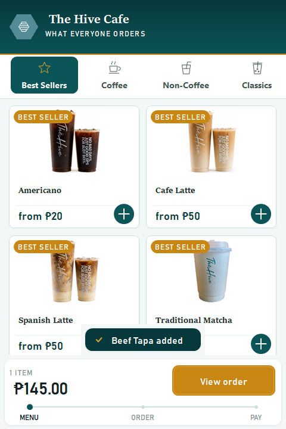

# The Hive Cafe Kiosk — v2.2.0

## New

- **You can see that your tap landed.** Adding an item now shows a brief
  confirmation just above the cart — *Americano added* — which fades on its own
  after about a second and a half. Before this, the only sign an item went in was
  the small total at the bottom changing, which is easy to miss at arm's length
  on a busy counter. Guests were tapping twice and ending up with two.
- It says the quantity when there is more than one (*3 x Americano added*), reads
  in Filipino as **Naidagdag ang Americano**, and never covers the tile you just
  tapped or swallows a tap of its own.

## Also

- **The release history now goes back to the beginning.** Added
  [v1.0](v1.0.md), the first working version from March 2026, and
  [v1.1](v1.1.md), the rebuild that the current design came from, plus an index
  of every release.

## Payment status

Unchanged: **there is no connected payment processor.** Cash orders wait for
payment at the counter. Card and e-wallet are clearly labelled demonstrations —
they do not charge money, collect card details, or show a live payment QR.
Receipts are local text copies, not official tax receipts.

## Install

Build from source at tag `v2.2.0` and run `kiosk/bin/Release/kiosk.exe` on
Windows with .NET Framework 4.7.2 or later installed. Keep `kiosk.exe.config`
beside the executable. The kiosk stores its data as XML under
`%LOCALAPPDATA%\TheHiveCafe` and needs no database engine.

---

Verified with the repository smoke suite — now 33 checks, including three
covering the new confirmation: that adding records it, that the menu shows it
once and clears it, and that clearing the cart drops a pending one.
