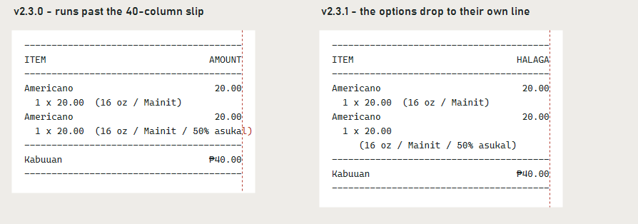

# The Hive Cafe Kiosk — v2.3.1



## Fixed

- **The Filipino receipt now fits the printer.** The printed copy is 40
  columns wide, the width of a small thermal printer. Filipino item details
  are longer than the English ones, and one ran off the edge:

  ```
    1 x 20.00  (16 oz / Mainit / 50% asukal)      42 columns
  ```

  A 40-column printer wraps or cuts a line like that, usually mid-word. When
  the details won't fit beside the price now, they move to their own
  indented line as a whole, so "50% asukal" stays together:

  ```
    1 x 20.00
       (16 oz / Mainit / 50% asukal)
  ```

  English slips have not changed at all. Their details still fit on one line.

- **The amount column is translated.** The printed Filipino slip still said
  **AMOUNT** above the prices. It now says **HALAGA**, the same as the screen.

## Payment status

Unchanged: **there is no connected payment processor.** Cash orders wait for
payment at the counter. Card and e-wallet are clearly labelled demonstrations —
they do not charge money, collect card details, or show a live payment QR.
Receipts are local text copies, not official tax receipts.

## Install

Build from source at tag `v2.3.1` and run `kiosk/bin/Release/kiosk.exe` on
Windows with .NET Framework 4.7.2 or later installed. Keep `kiosk.exe.config`
beside the executable. The kiosk stores its data as XML under
`%LOCALAPPDATA%\TheHiveCafe` and needs no database engine.

---

Verified with the repository smoke suite — now 40 checks, three of them new:
every line of the Filipino slip fits 40 columns, the amount column is
translated, and a long item detail is never split mid-phrase.
