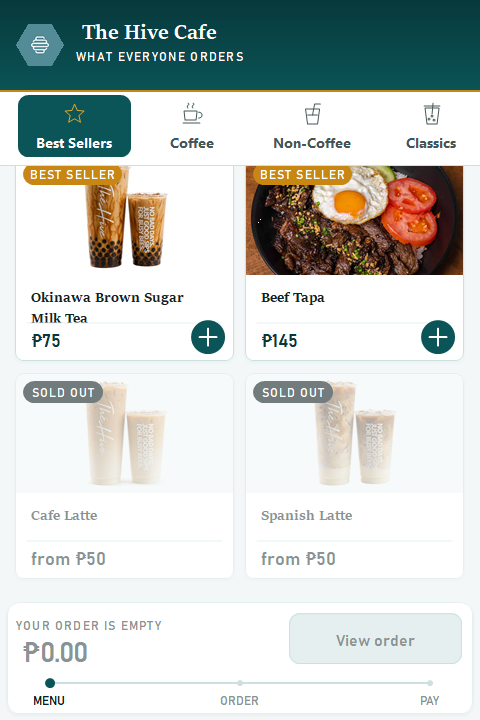

# The Hive Cafe Kiosk — v2.3.0

## Changed

- **Sold-out items are shown instead of hidden.** Until now they vanished from
  the menu entirely, so a guest looking for their usual drink found it simply
  absent — and the reasonable conclusion is that the kiosk is broken or the cafe
  dropped the item, which sends them to ask staff. That is the one errand the
  kiosk exists to save.

  They now stay on the menu with the photo washed back, the name and price
  muted, a grey **Sold out** badge where the Best Seller badge would sit, and no
  add button. They settle to the end of their category so they never break up
  the run of things you can actually order, and tapping one does nothing rather
  than opening a page that would only refuse you at the end.

  In Filipino the badge reads **Ubos na**.

- Checkout still re-checks availability, so an item that sells out while a guest
  is mid-order is still caught before payment. That safety net has not moved.

## Also

- The release history now separates [v1.0](v1.0.md), the original designer-built
  prototype from March 2026, from [v1.1](v1.1.md), the rebuild the current
  design came from — each with screenshots from that build.

## Payment status

Unchanged: **there is no connected payment processor.** Cash orders wait for
payment at the counter. Card and e-wallet are clearly labelled demonstrations —
they do not charge money, collect card details, or show a live payment QR.
Receipts are local text copies, not official tax receipts.

## Install

Build from source at tag `v2.3.0` and run `kiosk/bin/Release/kiosk.exe` on
Windows with .NET Framework 4.7.2 or later installed. Keep `kiosk.exe.config`
beside the executable. The kiosk stores its data as XML under
`%LOCALAPPDATA%\TheHiveCafe` and needs no database engine.

---

Verified with the repository smoke suite — now 37 checks, four of them new:
that a sold-out item stays on the menu, that its tile is marked, that sold-out
items settle to the end of the category, and that tapping one opens nothing.
