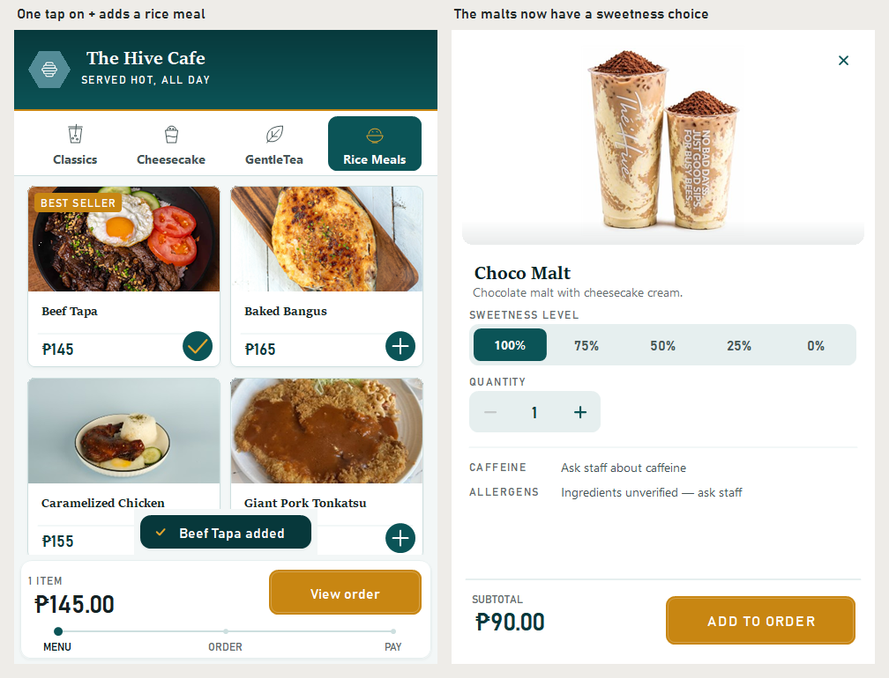
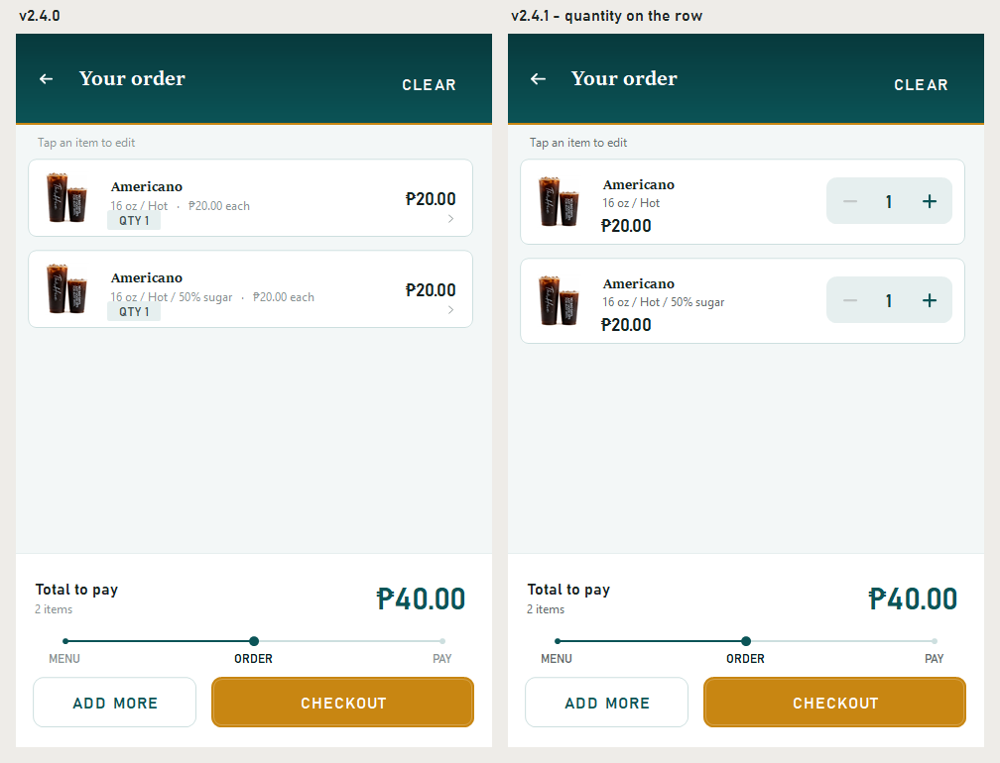
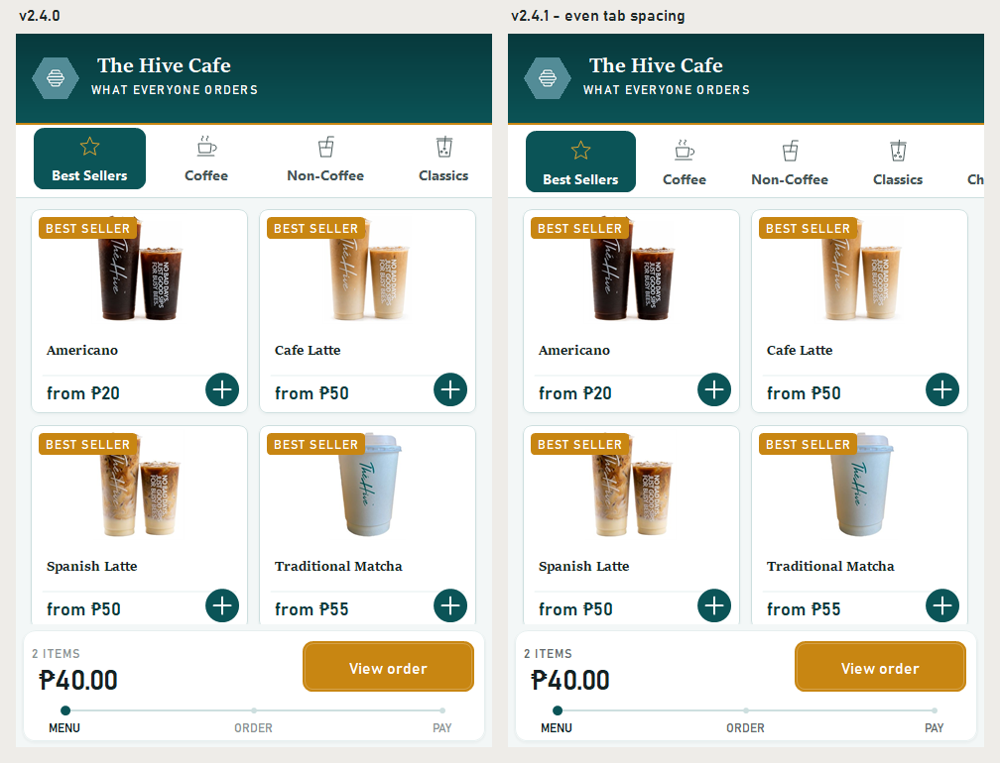
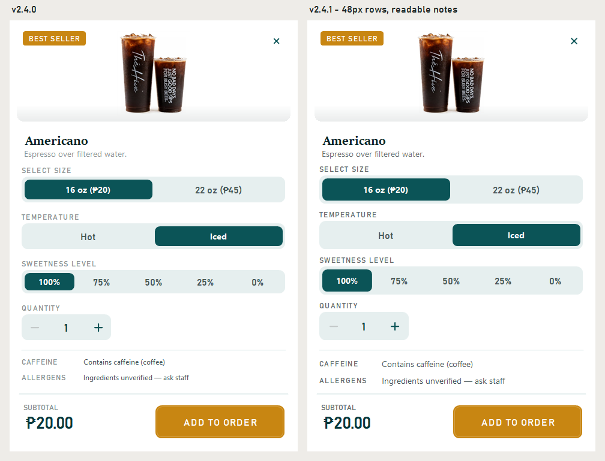
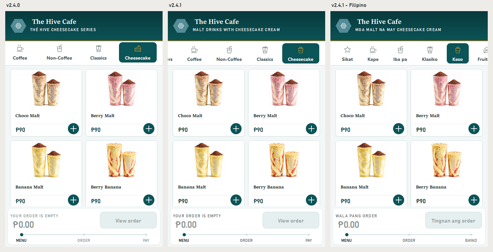

# The Hive Cafe Kiosk — v2.4.1

A touch and readability pass: bigger tap zones, text that reads under cafe
lighting, and fewer taps for the things guests do most.

## New

- **One tap on + adds a rice meal.** The + on a menu tile looked like "add"
  but only opened the product page, the same as tapping anywhere else on the
  tile. For items with nothing to choose it now adds the item straight to the
  order. The + turns into a tick, the "added" message confirms it, and the
  guest stays on the menu. Drinks still open their page, since size and hot
  or iced matter too much to guess.

- **Change quantity right in the cart.** Adding one more of something used to
  take three taps and a trip to another screen. Each cart row now has its own
  − and + stepper. Minus stops at one, so a slip can't remove an item;
  removing and changing options still go through the edit screen.

  

## Changed

- **Every tap zone is at least 48 × 48px.** An audit of every guest screen in
  both languages found the back arrow, the product close button and the
  option rows at 40–44px. They are all 48px now, and the test suite re-checks
  every screen on every run.

- **Even spacing on the category tabs.** Short labels were padded out and
  long ones weren't, so the gaps between labels ran from 38 to 50px. Every
  label is now the same distance from the next. Classics also used to end
  exactly at the screen edge, with nothing peeking out to show the row
  scrolls, which left Rice Meals hard to find. The next tab now shows at the
  edge.

  

- **Secondary text is readable.** Descriptions, section labels and hints
  were a light grey at 2.9:1 contrast, under the 4.5:1 that body text needs.
  They are now a darker grey that clears 4.5:1 on every surface. Things
  meant to look inactive, like disabled buttons and sold-out items, keep the
  lighter grey.

- **Readable caffeine and allergen notes.** They were the smallest text on
  the product page. The notes that someone with an allergy most needs to
  read are now body size, with labels that match the rest of the page. The
  wording is unchanged: "Ingredients unverified — ask staff" stays until the
  cafe confirms real ingredients.

  

- **The Cheesecake tab says what it holds.** Everything in it is a malt drink
  topped with cheesecake cream, but the tab had a cake-slice icon and the
  tagline "The Hive cheesecake series". The name stays, since it matches the
  printed menu at the counter. The icon is now a cup with the cream heaped
  on top, and the tagline reads **"Malt drinks with cheesecake cream"**
  (**"Mga malt na may cheesecake cream"**). These malts also now get a
  sweetness choice, which they never had.

  

- **Filipino button labels keep their capitals.** Letter-spaced labels like
  **MAGBAYAD** and **SIGE** came out in mixed case in Filipino, which read as
  broken. They are now in capitals, as in English.

## Fixed

- A rice meal in the cart read "Beef Tapa / Regular". There is nothing to
  choose on a rice meal, so the "Regular" line is gone.
- Every dash on screen is now the same long dash in both languages. The
  Filipino allergen note had used a semicolon.
- The cart's Clear button was cut off as "BURAH…" in Filipino. It now sizes
  itself to its label.

## Also

- The honey Add to order and Pay buttons keep their white text by choice, at
  3.05:1 contrast. The alternatives are kept in the design options folder.

## Payment status

Unchanged: **there is no connected payment processor.** Cash orders wait for
payment at the counter. Card and e-wallet are clearly labelled demonstrations —
they do not charge money, collect card details, or show a live payment QR.
Receipts are local text copies, not official tax receipts.

## Install

Build from source at tag `v2.4.1` and run `kiosk/bin/Release/kiosk.exe` on
Windows with .NET Framework 4.7.2 or later installed. Keep `kiosk.exe.config`
beside the executable. The kiosk stores its data as XML under
`%LOCALAPPDATA%\TheHiveCafe` and needs no database engine.

---

Verified with the repository smoke suite — now 55 checks, twelve of them new.
The new checks press real buttons at real positions: the + adds a rice meal
without leaving the menu, the + on a drink opens its page, the cart stepper
adds in place and stops at one. They also cover the 48px tap audit on every
screen and 4.5:1 contrast for every text colour.
