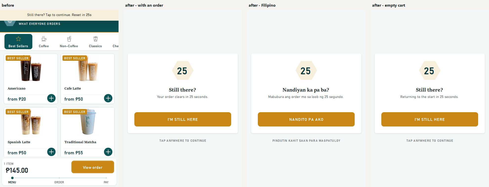
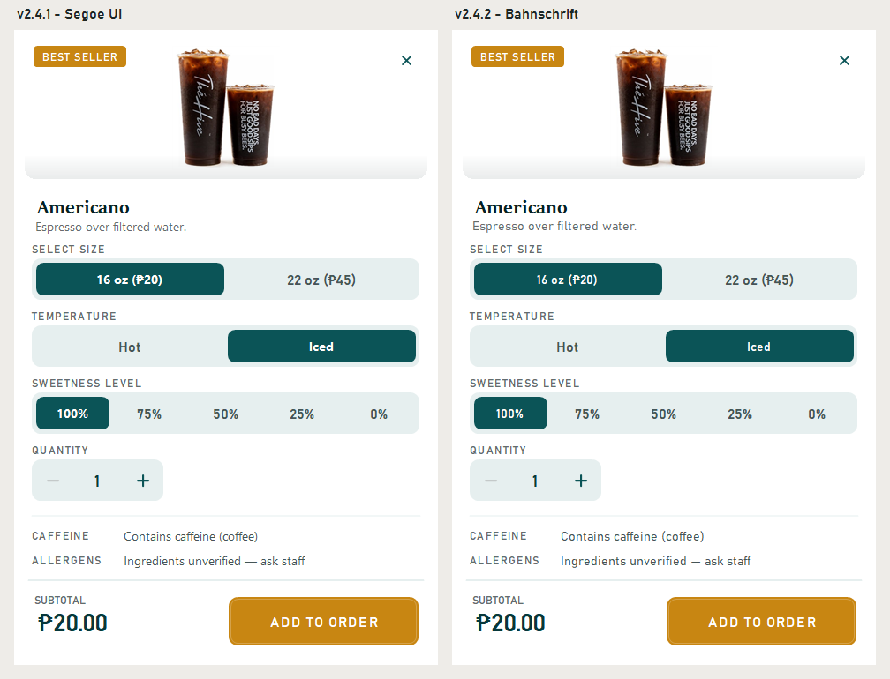
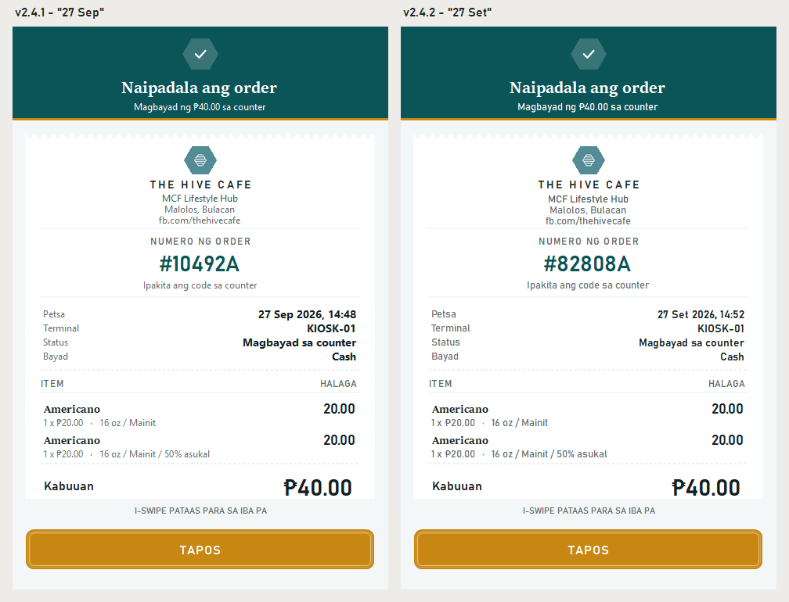

# The Hive Cafe Kiosk — v2.4.2

## Changed

- **The idle warning is hard to miss.** After 90 idle seconds the kiosk warns,
  and at two minutes it clears the order and resets. The warning used to be a
  thin strip across the very top of the screen, while a guest reading the
  menu is looking at the middle. Missing it cost the order, most often for
  the guest who was simply taking their time.

  It now fills the screen. The seconds left sit large in the hive hexagon,
  with the words **"Your order clears in 25 seconds."** when there is an
  order, and a large **I'm still here** button. Any tap dismisses it, and that
  tap stops there. It can't also press a menu tile hidden underneath.

- **One typeface for everything that isn't a heading.** Descriptions, option
  lines like "16 oz / Iced", hints and notices were set in Segoe UI, the
  Windows system font, which made the kiosk look like a stock Windows app.
  They are now in Bahnschrift, the same family already used for prices and
  labels. It is a clean face designed to be read at a distance, and it has
  its own peso sign. Product names keep the serif. No stock system font is
  left on the guest screens.

  

## Fixed

- **Receipt dates follow the guest's language.** A Filipino receipt was
  translated except for the month, "27 Sep 2026". The month followed the
  computer's region setting, which also meant a PC set to Filipino would
  have given English guests Filipino months. Both the screen and the printed
  slip now use the guest's language: **27 Set 2026** in Filipino,
  **27 Sep 2026** in English.

  

## Payment status

Unchanged: **there is no connected payment processor.** Cash orders wait for
payment at the counter. Card and e-wallet are clearly labelled demonstrations —
they do not charge money, collect card details, or show a live payment QR.
Receipts are local text copies, not official tax receipts.

## Install

Build from source at tag `v2.4.2` and run `kiosk/bin/Release/kiosk.exe` on
Windows with .NET Framework 4.7.2 or later installed. Keep `kiosk.exe.config`
beside the executable. The kiosk stores its data as XML under
`%LOCALAPPDATA%\TheHiveCafe` and needs no database engine.

---

Verified with the repository smoke suite — now 62 checks, seven of them new.
They check that no text uses a stock Windows font, and that receipts are
dated in the guest's language even on a PC set to the other one. They also
check that the idle warning covers the whole screen and warns about the
order, that the tap which dismisses it goes no further, and that the next
tap reaches the page.
