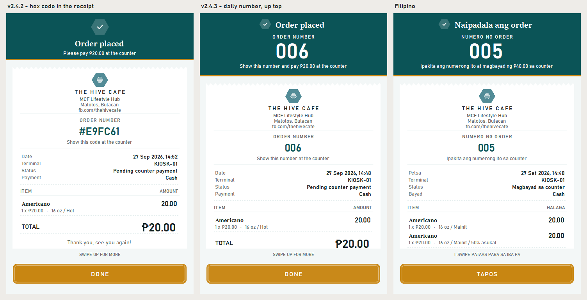
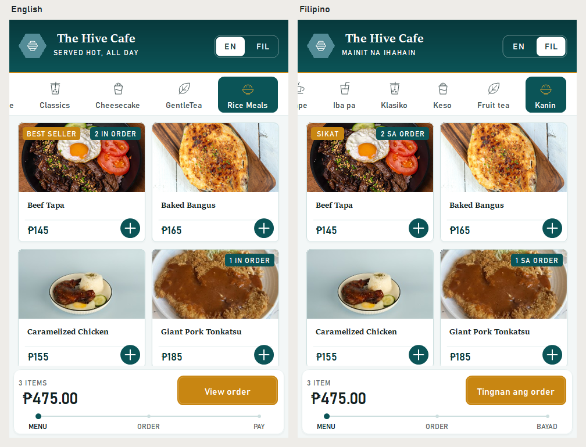
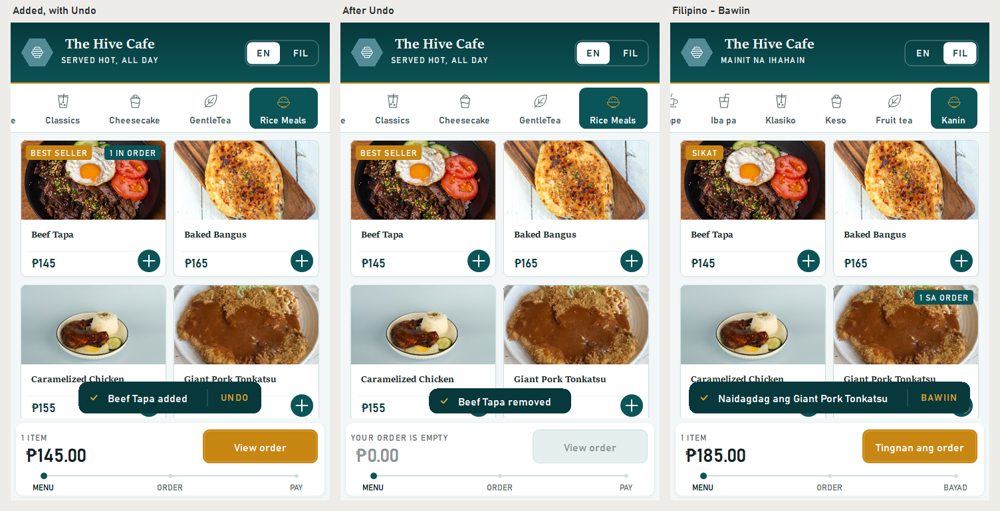
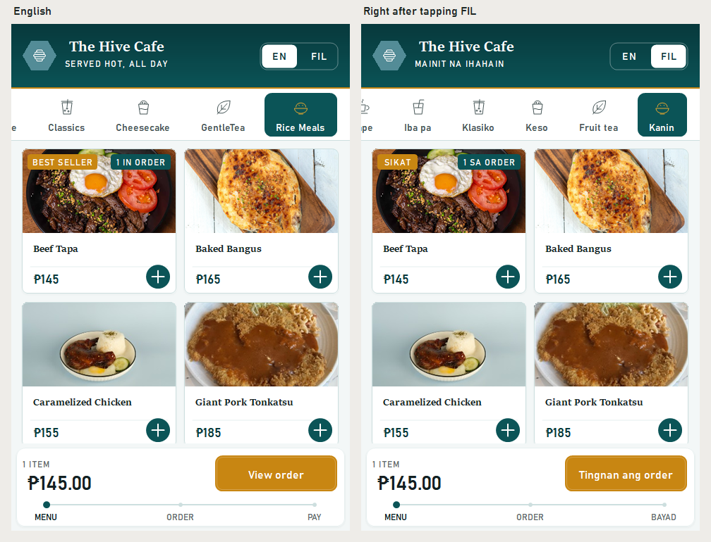

# The Hive Cafe Kiosk — v2.4.3

The order flow, from the first tap to the counter: see what's already in
the order, take back a mistake in one tap, switch language mid-order, and
leave with a number that's easy to say out loud.

## New

- **Order numbers people can say out loud.** The receipt used to give the
  guest a code like **#84C0E8** to read at the counter, where 0 and O, or 8
  and B, sound alike. Orders are now numbered through the day,
  **001, 002, 003…**, on the receipt, the printed slip and the staff
  history. The number starts again at 001 each day. It is counted from the
  day's saved orders, so restarting the kiosk can't reset it or hand out the
  same number twice. Orders saved before this update keep their old code.

- **The number is the biggest thing on the receipt screen.** It is what the
  guest carries to the counter, but it used to sit inside the scrolling
  receipt at the same size as the total. It now leads the band at the top,
  which stays in place while the receipt scrolls, with **"Show this number
  and pay ₱20.00 at the counter"** beneath it.

- **See what's already in your order.** Menu tiles now show a small teal tag,
  **2 IN ORDER**, opposite the Best Seller tag. It answers "did I already add
  that?" without opening the cart. The count adds up hot and iced, and both
  sizes, and it updates the moment something is added, changed or cleared.

  

- **Undo.** The + adds a rice meal in one tap, so one stray tap adds a ₱145 meal.
  The "added" message now has an **Undo** button (**Bawiin**) for five
  seconds, a full 48px tap target. It takes back exactly what that add put
  in: one meal from a quick add, or "2 x Cafe Latte" from the product page.
  If the guest has changed that item in the cart since, Undo leaves it alone.

  

- **Switch language from the menu.** The welcome screen was the only place to
  change language, so a guest who tapped Start without noticing it had to
  give up the order to switch. The menu header now has an **EN | FIL**
  switch showing both options. Switching keeps the category, the scroll
  position and the order exactly as they were.

  

## Fixed

- The Filipino **SIKAT** tag was sized for the English "BEST SELLER" and sat
  in a tag too wide for it. It now fits its word.
- The "added" message had a page-coloured box around it that cut through the
  names of the tiles behind it. The message is now just its own rounded
  shape.
- The cart's **Clear** button sat 3px lower than the back arrow. It now lines
  up.

## Payment status

Unchanged: **there is no connected payment processor.** Cash orders wait for
payment at the counter. Card and e-wallet are clearly labelled demonstrations —
they do not charge money, collect card details, or show a live payment QR.
Receipts are local text copies, not official tax receipts.

## Install

Build from source at tag `v2.4.3` and run `kiosk/bin/Release/kiosk.exe` on
Windows with .NET Framework 4.7.2 or later installed. Keep `kiosk.exe.config`
beside the executable. The kiosk stores its data as XML under
`%LOCALAPPDATA%\TheHiveCafe` and needs no database engine. Existing order
history carries over; older orders keep their six-character codes.

---

Verified with the repository smoke suite — now 89 checks, twenty-seven of
them new:

- **Order numbers:** they count up through the day, yesterday's orders don't
  count, a damaged record still holds its number, and the number is read
  back from history.
- **Undo:** it takes back exactly one add and never reaches further back.
- **In-order tags:** the tile count follows the cart, and both tags fit side
  by side at 99 in both languages.
- **Language switch:** switching keeps the guest in place, the category tabs
  re-measure, and every category tagline fits beside the switch.
