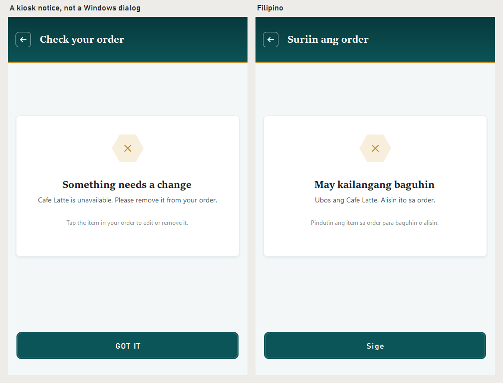
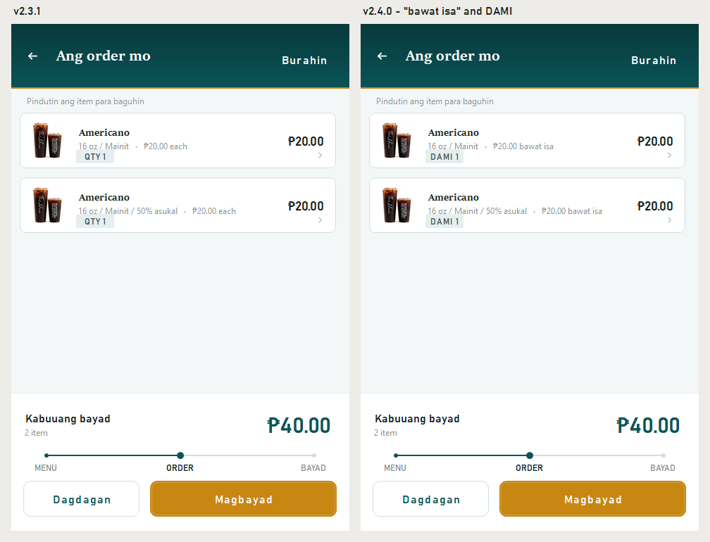
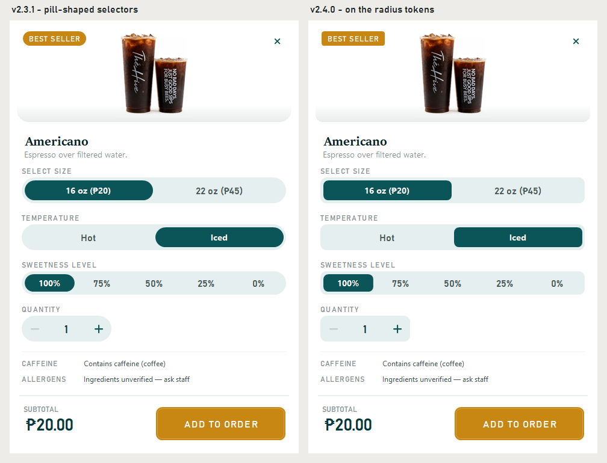

# The Hive Cafe Kiosk — v2.4.0

## Changed

- **No more Windows dialogs in front of guests.** Four situations still
  showed a stock Windows message box: an item that could not be added, a
  cart edit that failed, a checkout blocked by a sold-out item, and an order
  that could not be saved. On a touchscreen that means a title bar and
  tiny system buttons, the look the v2.1 Clear screen had already moved away
  from.

  All four now use a kiosk notice built like the Clear confirmation: the
  house header, a card with a hexagon mark, the message, and one full-width
  button. The blocked checkout also tells the guest what to do next: tap the
  item in the order to edit or remove it. Every notice is in English and
  Filipino.

- **Filipino everywhere in the cart and the idle warning.** Three pieces were
  still in English. The cart said "₱20.00 each" and now says
  **"bawat isa"**, the quantity chip said "QTY" and now says **"DAMI"**, and
  the "still there?" warning had never been translated at all.

  

- **Every corner is now on the design's radius scale.** v2.1 moved cards and
  buttons from pills to 8–10px corners, but the product page still had pill
  shapes. The size, temperature and sweetness selectors and the quantity
  stepper were fully rounded, right above the Add to order button with its
  10px corners. They now match it. Badges like **Best Seller** get a 4px corner,
  so they read as printed labels rather than pills.

  

## Payment status

Unchanged: **there is no connected payment processor.** Cash orders wait for
payment at the counter. Card and e-wallet are clearly labelled demonstrations —
they do not charge money, collect card details, or show a live payment QR.
Receipts are local text copies, not official tax receipts.

## Install

Build from source at tag `v2.4.0` and run `kiosk/bin/Release/kiosk.exe` on
Windows with .NET Framework 4.7.2 or later installed. Keep `kiosk.exe.config`
beside the executable. The kiosk stores its data as XML under
`%LOCALAPPDATA%\TheHiveCafe` and needs no database engine.

---

Verified with the repository smoke suite — now 43 checks, three of them new:
a blocked checkout opens a kiosk notice rather than a dialog, it leaves the
order untouched, and the idle warning speaks Filipino.
